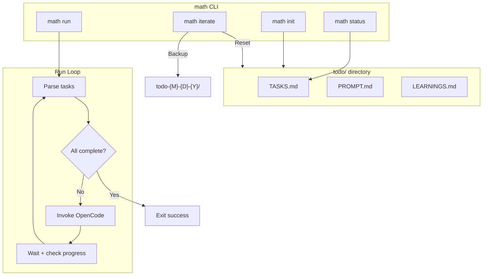

# math - Multi-Agent Todo Harness

A light meta agent orchestration harness designed to coordinate multiple AI agents working together to accomplish tasks from a TODO list.

## Core Concept

The primary responsibility of this harness is to **reduce context bloat** by digesting a project plan into three documents:

| Document | Purpose |

|----------|---------|

| `TASKS.md` | Task list with status tracking and dependencies |

| `LEARNINGS.md` | Accumulated insights from completed tasks |

| `PROMPT.md` | System prompt with guardrails ("signs") |

The harness consists of a simple for-loop, executing a new coding agent with a mandate from `PROMPT.md` to complete a *single* task from `TASKS.md`, while reading and recording any insight gained during the work into `LEARNINGS.md`.

## Architecture



## Key Files

| File | Purpose |

|------|---------|

| [`index.ts`](index.ts) | CLI entry point using Bun.argv |

| `src/loop.ts` | Main Ralph loop logic |

| `src/tasks.ts` | Parse/update TASKS.md |

| `src/templates.ts` | Template files for `math init` |

## Bun Primitives (Zero Dependencies)

| Need | Bun Primitive |

|------|---------------|

| CLI args | `Bun.argv` / `process.argv` |

| File read | `Bun.file(path).text()` |

| File write | `Bun.write(path, content)` |

| Shell commands | `Bun.$\`command\`` |

| Directory ops | `Bun.$\`cp -r\``, `Bun.$\`mkdir\`` |

| Colors | ANSI escape codes (no chalk) |

## Implementation

### 1. CLI Commands (using Bun.argv)

```typescript
const [command, ...args] = Bun.argv.slice(2);

switch (command) {
  case "init":     // Create todo/ with template files
  case "run":      // Start the loop (--model, --max-iterations)
  case "status":   // Show current task counts  
  case "iterate":  // Backup todo/ and reset for new sprint
  default:         // Show help
}
```

### 2. Task Parser

Parse TASKS.md format:

```markdown
### task-id
- content: Description
- status: pending | in_progress | complete
- dependencies: task-1, task-2
```

### 3. Loop Logic

Port `ralph.sh` to TypeScript using `Bun.$` for shell commands:

- Count task statuses
- Exit when all complete
- Invoke OpenCode with attached files
- Check for progress after each iteration

### 4. Package Configuration

Set up as global CLI:

```json
{
  "bin": { "math": "./index.ts" }
}
```

## Templates

The `math init` command creates:

- `todo/PROMPT.md` - Generic system prompt with signs
- `todo/TASKS.md` - Empty task tracker template
- `todo/LEARNINGS.md` - Empty learnings log

## Iterate Command

The `math iterate` command enables starting a new sprint while preserving history:

1. **Backup**: Copy `todo/` to `todo-{M}-{D}-{Y}/` (e.g., `todo-1-11-2026/`)
2. **Reset**: Clear TASKS.md and LEARNINGS.md to templates, keep PROMPT.md signs

This preserves completed work as a historical record while preparing for new goals.